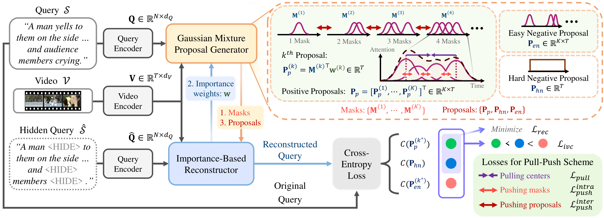

# PPS: Gaussian Mixture Proposals with Pull-Push Learning Scheme to Capture Diverse Events for Weakly Supervised Temporal Video Grounding

This repositroy contains a Pytorch implementation of the paper 'Gaussian Mixture Proposals with Pull-Push Learning Scheme to Capture Diverse Events for Weakly Supervised Temporal Video Grounding' (PPS) accepted in AAAI2024. [Paper](https://arxiv.org/pdf/2312.16388v1.pdf)



In the weakly supervised temporal video grounding study, previous methods use predetermined single Gaussian proposals which lack the ability to express diverse events described by the sentence query. To enhance the expression ability of a proposal, we propose a Gaussian mixture proposal that can depict arbitrary shapes by learning importance, centroid, and range of every Gaussian in the mixture. In learning the Gaussian mixture proposal, each Gaussian is not trained in a feature space but is implemented over a temporal location. Thus the conventional feature-based learning for Gaussian mixture model is not valid for our case. In our special setting, to learn moderately coupled Gaussian mixture capturing diverse events, we newly propose a pull-push learning scheme using pulling and pushing losses, each of which plays an opposite role to the other. The effects of components in our scheme are verified in-depth with extensive ablation studies and the overall scheme achieves state-of-the-art performance.

## Results

### ActivityNet Captions Dataset

|  Method  | Rank1@0.1 | Rank1@0.3 | Rank1@0.5 | Rank5@0.1 | Rank5@0.3 | Rank5@0.5 |
|  :-----: | :-------: | :-------: | :-------: | :-------: | :-------: | :-------: |
|   PPS   |   81.84   |   59.29   |   31.25   |   95.28   |   85.54   |   71.32   |
| PPS_re  |   80.17   |   56.91   |   32.04   |   95.26   |   85.84   |   74.85   |

### Charades-STA Dataset

|  Method  | Rank1@0.3 | Rank1@0.5 | Rank1@0.7 | Rank5@0.3 | Rank5@0.5 | Rank5@0.7 |
|  :-----: | :-------: | :-------: | :-------: | :-------: | :-------: | :-------: |
|   PPS   |   69.06   |   51.49   |   26.16   |   99.18   |   86.23   |   53.01   |
| PPS_re  |   68.18   |   50.19   |   26.19   |   98.54   |   87.40   |   53.32   |

## Quick Start

### 1. Dependencies

We provide both 1) the model used in the paper (PPS) and 2) the model of refactored code (PPS_re).
Due to changes in our environment and code refactoring, we use slightly different hyperparameters from the paper and the performance is slightly changed at all metrics, as shown in the table above.
Our models can be downloaded [here](https://drive.google.com/file/d/1bf9d_UpnPSDZnmAmjD_E5o2SOaWOXDRg/view?usp=sharing).

We use the following dependencies.

- ubuntu 18.04.6
- cuda 11.6
- cudnnn 8
- python 3.10.8
- pytorch 2.0.1
- nltk 3.8.1
- wandb 0.15.2
- h5py 3.8.0
- fairseq 0.12.2

If the fairseq automatically installs another version of PyTorch, delete that PyTorch because we use PyTorch version 2.0.1.

Please use the following command to download some resources from the Natural Language Toolkit (nltk).

```
python
>>> import nltk
>>> nltk.download('punkt')
>>> nltk.download('averaged_perceptron_tagger')
```

### 2. Data preparation

We use two public datasets: the ActivityNet Captions dataset and the Charades-STA dataset.

For the ActivityNet Captions dataset, [C3D](http://activity-net.org/challenges/2016/download.html#c3d) features are used.
We use the converted C3D features provided by [LGI](https://github.com/JonghwanMun/LGI4temporalgrounding).
Please download the converted C3D features and save them as `data/activitynet/sub_activitynet_v1-3.c3d.hdf5`.

For the Charades-STA dataset, [I3D](https://github.com/piergiaj/pytorch-i3d) features are used.
We use the converted I3D features provided by [CPL](https://github.com/minghangz/cpl).
Please download the converted I3D features and save them as `data/charades/i3d_features.hdf5`.

The directory structure should be

```
data
├── activitynet
│   ├── sub_activitynet_v1-3.c3d.hdf5
│   ├── glove.pkl
│   ├── train_data.json
│   ├── test_data.json
├── charades
│   ├── i3d_features.hdf5
│   ├── glove.pkl
│   ├── train.json
│   ├── test.json
```

### 3. Evaluation of pre-trained models


We provide our trained model in the folder [`checkpoint/`](checkpoint/). 

For evaluation of 1) the model used in the paper (PPS) on the ActivityNet Captions dataset, please use the following command.
```
bash script/eval_activitynet.sh
```

For evaluation of 2) the model of refactored code (PPS_re) on the ActivityNet Captions dataset, please use the following command.
```
bash script/eval_activitynet_refact.sh
```

For evaluation of 1) the model used in the paper (PPS) on the Charades-STA dataset, please use the following command.
```
bash script/eval_charades.sh
```

For evaluation of 2) the model of refactored code (PPS_re) on the Charades-STA dataset, please use the following command.
```
bash script/eval_charades_refact.sh
```

### 4. Training from scratch

For training the model from scratch on the ActivityNet Captions dataset, please use the following command.

```
bash script/train_activitynet.sh
```

For training the model from scratch on the Charades-STA dataset, please use the following command.

```
bash script/train_charades.sh
```

Logs and checkpoints are automatically saved in the folders [`log/`](log/) and [`checkpoint/`](checkpoint/), respectively.

We use [Wandb](https://wandb.ai/site) for the visualization of learning curves.
If you want to disable it, please set `use_wandb` to `False` in the folder [`config/`](config/).
Also, other configurations can be modified in the folder [`config/`](config/).

## Acknowledgement
The following repositories were helpful for our implementation.

https://github.com/JonghwanMun/LGI4temporalgrounding

https://github.com/minghangz/cpl

https://github.com/jadore801120/attention-is-all-you-need-pytorch

https://github.com/wengong-jin/fairseq-py/tree/master/fairseq/optim

## Citation
If our code is helpful, please cite our paper.

```
@inproceedings{kim2024gaussian,
    title     = "{Gaussian Mixture Proposals with Pull-Push Learning Scheme to Capture Diverse Events for Weakly Supervised Temporal Video Grounding}",
    author    = {Kim, Sunoh and Cho, Jungchan and Yu, Joonsang and Yoo, YoungJoon and Choi, Jin Young},
    booktitle = {AAAI},
    year      = {2024}
}
```
